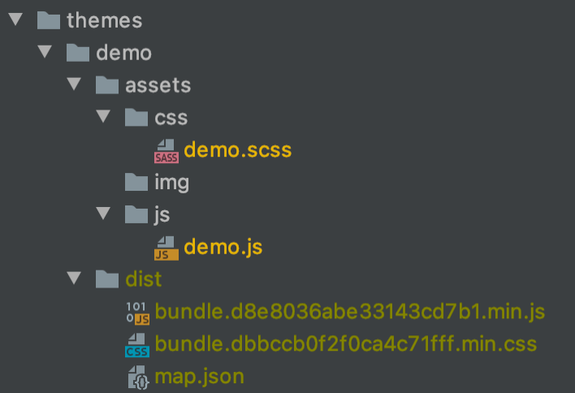

# webpack-asset-map
webpack plugin that generates a map of assets with hashed filenames, and WordPress theme demonstrating how to use it

https://dev.to/pixelgoo/how-to-configure-webpack-from-scratch-for-a-basic-website-46a5

## tl;dr

If your WordPress site has caching, and you bundle and minify your JS and CSS files with [webpack](https://webpack.js.org/), this plugin helps you give users the latest version of the files without bothering about version numbers.

## Requirements

- A local WordPress site.
- `npm`. 

## Setup

1. Open a terminal and check this project out from the [repo](https://github.com/andfinally/webpack-asset-map) into your site's `wp-content/themes` folder:

    ```bash
    git checkout https://github.com/andfinally/webpack-asset-map.git
    ```

2. Change into the theme folder:

    ```bash
    cd wp-content/themes/demo
    ```

3. Install webpack and its dependencies:

    ```bash
   npm i 
   ``` 

4. Run the webpack build:

    ```bash
   npm run build 
   ```
   
   This will process the JS and SCSS files in the `assets` folder and output three files into a new `dist` folder.
   
   
   
   
